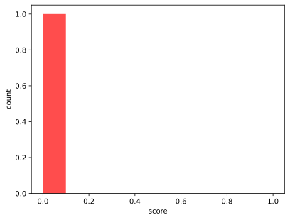

# Dashboard
## Evidence Score Distribution

The distribution of scores for evidence nodes across the graph.

??? example "click to view figure as table"

    |bin|count|
    |-|-|
    |0.0-0.1 {style="background-color:hsl(12.0, 100%, 61%)"} |1|
    |0.1-0.2 {style="background-color:hsl(24.0, 100%, 58%)"} |0|
    |0.2-0.3 {style="background-color:hsl(36.0, 100%, 54%)"} |0|
    |0.3-0.4 {style="background-color:hsl(48.0, 100%, 51%)"} |0|
    |0.4-0.5 {style="background-color:hsl(60.0, 100%, 47%)"} |0|
    |0.5-0.6 {style="background-color:hsl(72.0, 100%, 44%)"} |0|
    |0.6-0.7 {style="background-color:hsl(84.0, 100%, 40%)"} |0|
    |0.7-0.8 {style="background-color:hsl(96.0, 100%, 37%)"} |0|
    |0.8-0.9 {style="background-color:hsl(108.0, 100%, 33%)"} |0|
    |0.9-1.0 {style="background-color:hsl(120.0, 100%, 30%)"} |0|
## Expectations Score Distribution

The distribution of scores for expectations nodes across the graph.

??? example "click to view figure as table"

    |bin|count|
    |-|-|
    |0.0-0.1 {style="background-color:hsl(12.0, 100%, 61%)"} |1|
    |0.1-0.2 {style="background-color:hsl(24.0, 100%, 58%)"} |0|
    |0.2-0.3 {style="background-color:hsl(36.0, 100%, 54%)"} |0|
    |0.3-0.4 {style="background-color:hsl(48.0, 100%, 51%)"} |0|
    |0.4-0.5 {style="background-color:hsl(60.0, 100%, 47%)"} |0|
    |0.5-0.6 {style="background-color:hsl(72.0, 100%, 44%)"} |0|
    |0.6-0.7 {style="background-color:hsl(84.0, 100%, 40%)"} |0|
    |0.7-0.8 {style="background-color:hsl(96.0, 100%, 37%)"} |0|
    |0.8-0.9 {style="background-color:hsl(108.0, 100%, 33%)"} |0|
    |0.9-1.0 {style="background-color:hsl(120.0, 100%, 30%)"} |0|
## All Score Distribution

The distribution of scores for all nodes across the graph.

??? example "click to view figure as table"

    |bin|count|
    |-|-|
    |0.0-0.1 {style="background-color:hsl(12.0, 100%, 61%)"} |3|
    |0.1-0.2 {style="background-color:hsl(24.0, 100%, 58%)"} |0|
    |0.2-0.3 {style="background-color:hsl(36.0, 100%, 54%)"} |0|
    |0.3-0.4 {style="background-color:hsl(48.0, 100%, 51%)"} |0|
    |0.4-0.5 {style="background-color:hsl(60.0, 100%, 47%)"} |0|
    |0.5-0.6 {style="background-color:hsl(72.0, 100%, 44%)"} |0|
    |0.6-0.7 {style="background-color:hsl(84.0, 100%, 40%)"} |0|
    |0.7-0.8 {style="background-color:hsl(96.0, 100%, 37%)"} |0|
    |0.8-0.9 {style="background-color:hsl(108.0, 100%, 33%)"} |0|
    |0.9-1.0 {style="background-color:hsl(120.0, 100%, 30%)"} |0|
## Summary

| Category | Count |
|----------|-------|
|statements|3|
|reviewed statements|3|
|unreviewed statements|0|
|orphaned statements|0|
|statements with evidence|1|
|evidence|1|
|expectations|1|
